# Documentación actividad "Desarrollo colaborativo con Git y GitHub"

1. Se cambian los permisos dentro de Visual Studio Code con el fin de usar el editor del mismo como super usuario y asi crear el proyecto base

Imagen 1: Comandos utilizados para la creacion del proyecto base.

2. Se creo la rama features/recetas-colombianas y se empezaron a realizar cambios en el archivo colombianas.md

Imagen 2: Comandos utilizados para la creación de la nueva rama y cambio a la misma.
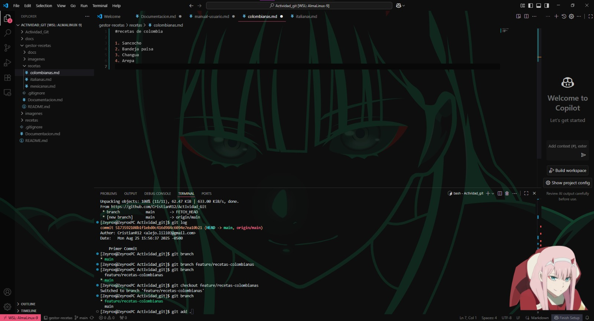

3. Una vez realizados los cambios en el archivo colombianas.md, se utilizaron los comandos "git add .", "git commit -m """ y "git push" para  subir los cambios a las recetas colombianas al repositorio. Con este primer commit, se realizó un pull request en la interfaz web de GitHub.

Imagen 3: Primer PR en GitHub por parte de la rama feature/recetas-colombianas.

4. Por otra parte, tras enviar una solicitud de colaboracion, el segundo estudiante realizó la clonación del repositorio.
Imagen 4: Comandos utilizados para la clonación del repositorio.

5. Tras la clonación del repositorio, se creó la rama features/recetas-mexicanas.
Imagen 5: Comandos utilizados para la creación de la rama para cambios en mexicanas.md.
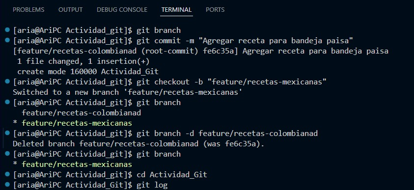

6. Posteriormente se realizaron cambios en el archivo mexicanas.md y se eliminó una carpeta adicional vacía llamada "Actividad_Git" creada a partir de la clonación; con estos cambios se realizó el primer commit para la rama features/rama-mexicanas.
Imagen 6: Primer commit para recetas-mexicanas.
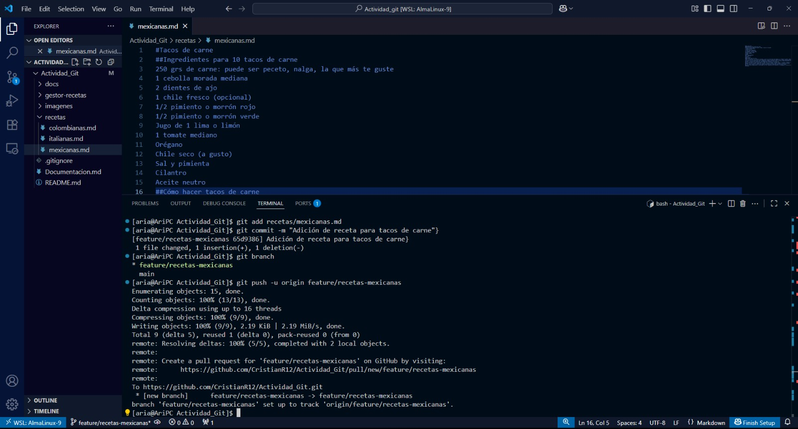

7. Se realizaron 2 commits adicionales después del paso anterior, los cuales se verificaron con el comando "git log".
Imagen 7: Git log para la rama features/recetas-mexicanas.
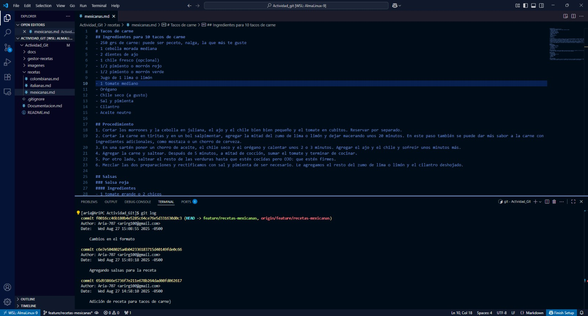

8. Con estos cambios realizados en la rama, se realizó un Pull Request para combinarlos con la main.
Imagen 8: PR en GitHub por parte de la rama feature/recetas-mexicanas.
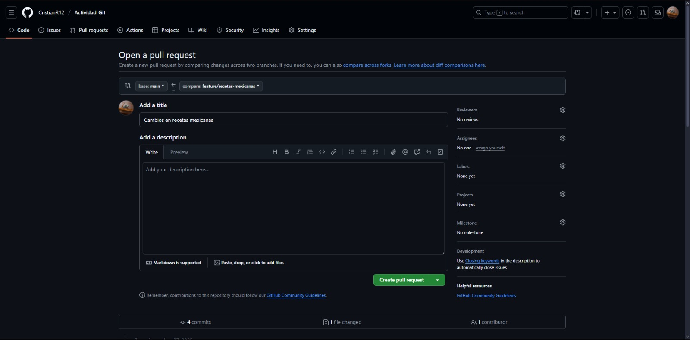
Imagen 9: PR en en revisión.
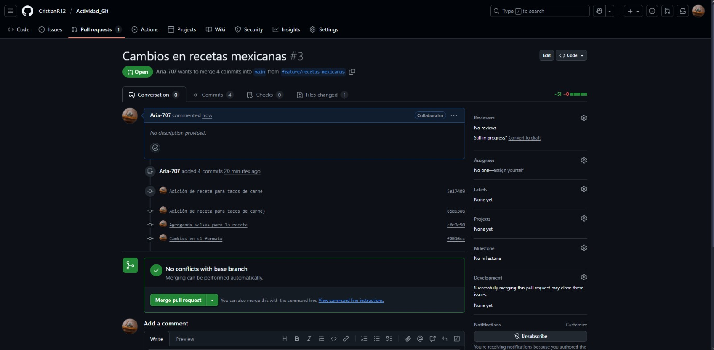

9. El primer estudiante revisó y acepto el Pull Request, con lo cual, se aceptó el Merge de los cambios en la rama main.
Imagen 10: PR aceptado y Merge realizado.
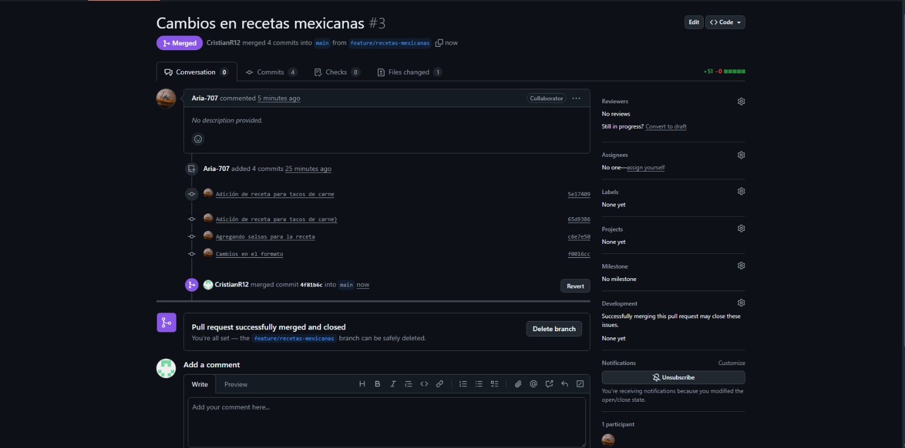

10. De forma paralela, el primer estudiante realizó sus respectivos commits, tanto en la rama features/recetas-colombianas y features/recetas-italianas.
Imagen 11: Git log para los cambios en colombianas.md.
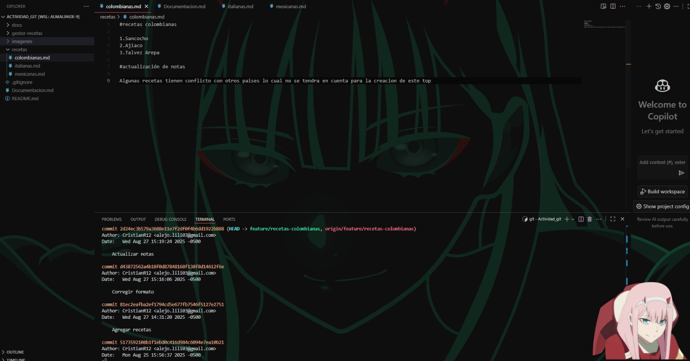

11. Una vez realizados estos commits, se finalizaron los cambios en las ramas y se realizó un pull request.
Imagen 12: PR para la rama features/rama-colombia.
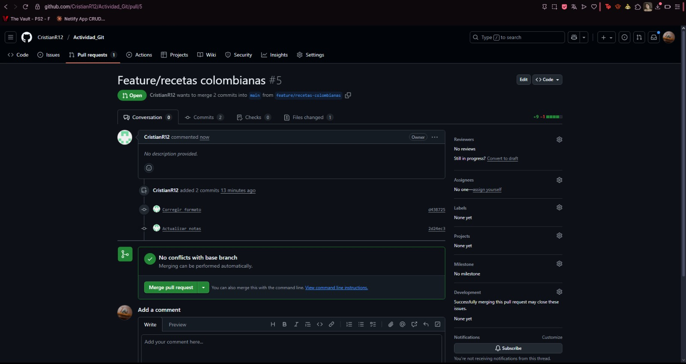

Imagen 13: PR para la rama features/rama-colombia.
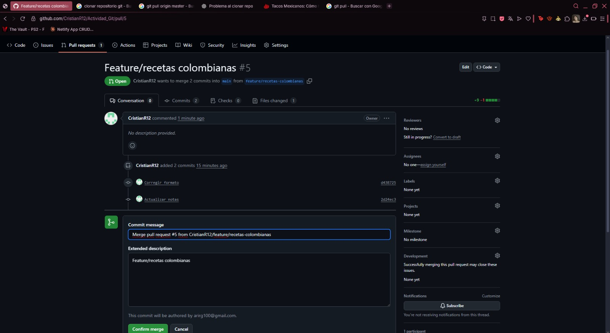

12. La petición y fusión con la rama main fue aceptada por el otro estudiante.
Imagen 14: Aceptación de PR para la rama features/rama-colombia.
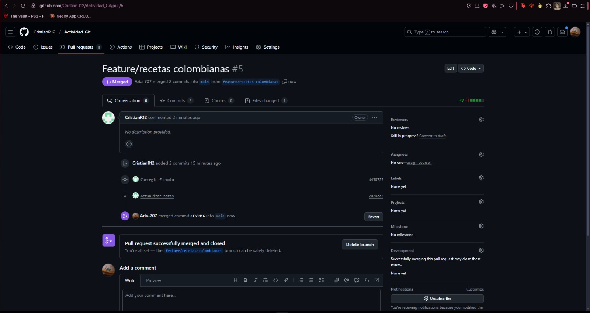

13. Para la práctica, se creo un conflicto en la rama-documentacion en el archivo Documentacion.md; el cual se presentó en el momento de realizar un pull request a la rama main.
Imagen 15: Creación de conflicto.
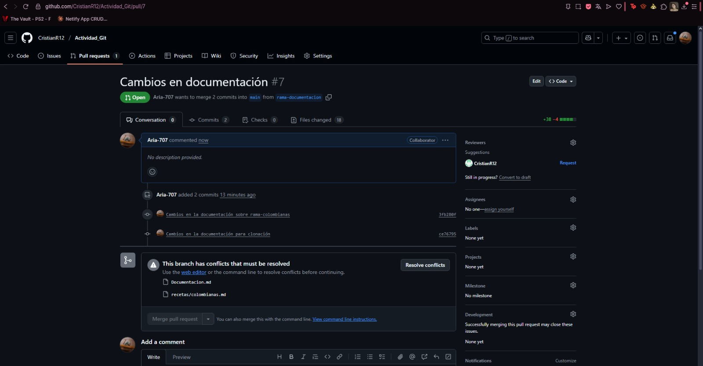

Imagen 16: Visualización del conflicto.
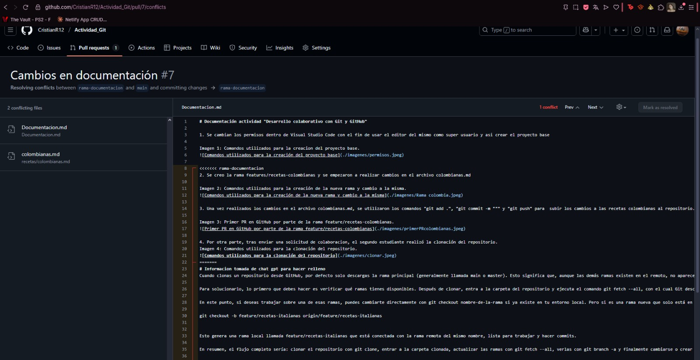

14. Este conflicto fue resuelto en el editor de código de GitHub.
Imagen 17: Resolución del conflicto.

15. Una vez arreglado el conflicto, se realizó un pull request para fusionar el archivo con los cambios definitivos en la rama main.
Imagen 18: PR para el archivo que generó el conflicto.
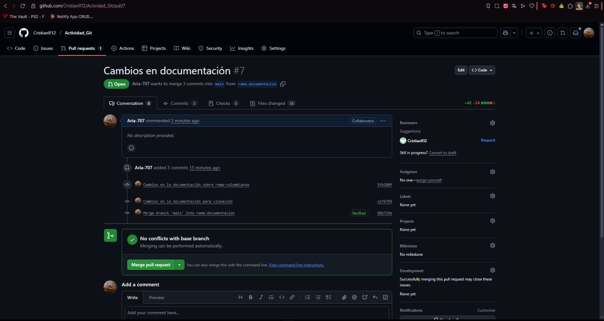

16. Y posteriormente, fue aceptado y fusionado.
Imagen 19: Fusión con el archivo que generó el conflicto.
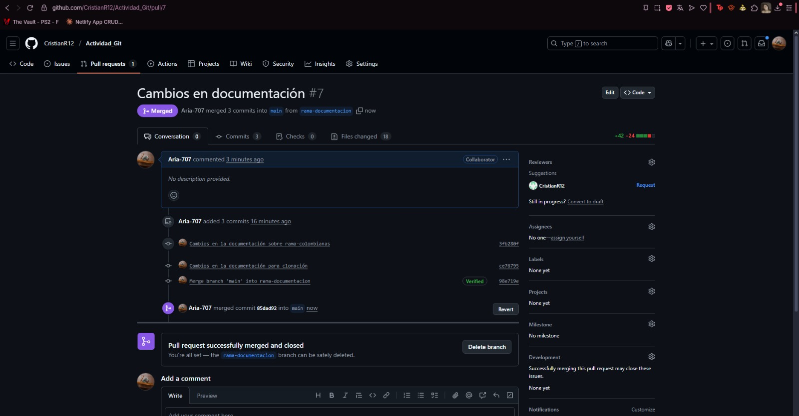

17. Con esto, se generó el tag para la indicar el fin de la primera versión, con "git tag".
Imagen 20: Creación de tag a partir de comandos.
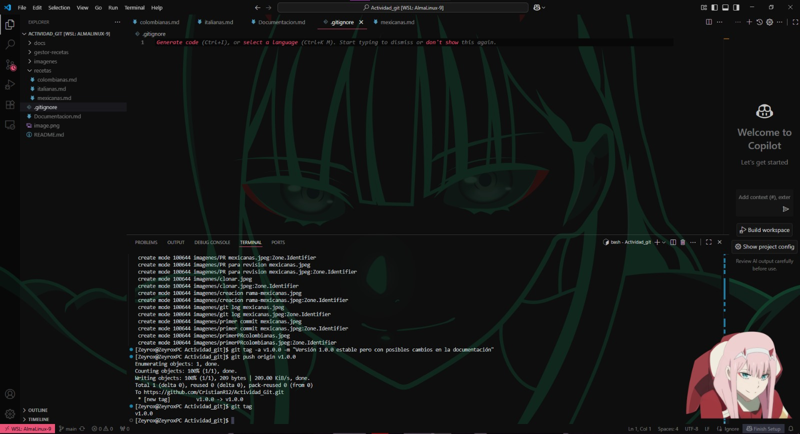

18. El último ejercicio realizado, fue la modificación y adición al repostorio de un archivo .gitignore, para que no se tenga en cuenta una carpeta .log o el archivo server.log. Este archivo fue subido desde la rama features/rama-colombiana y se realizó un pull request para combinarlo con la rama main.
Imagen 21: PR para el archivo .gitignore.
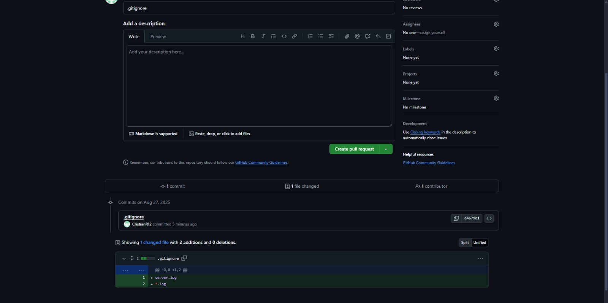

19. El otro estudiante revisó dicha petición y la aceptó en GitHub.
Imagen 22: Revisión del PR para el archivo .gitignore.
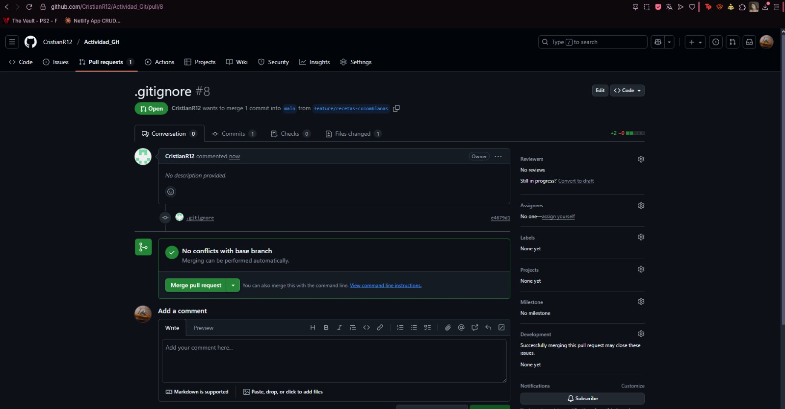

Imagen 23: Aceptación y merge del PR para el archivo .gitignore.
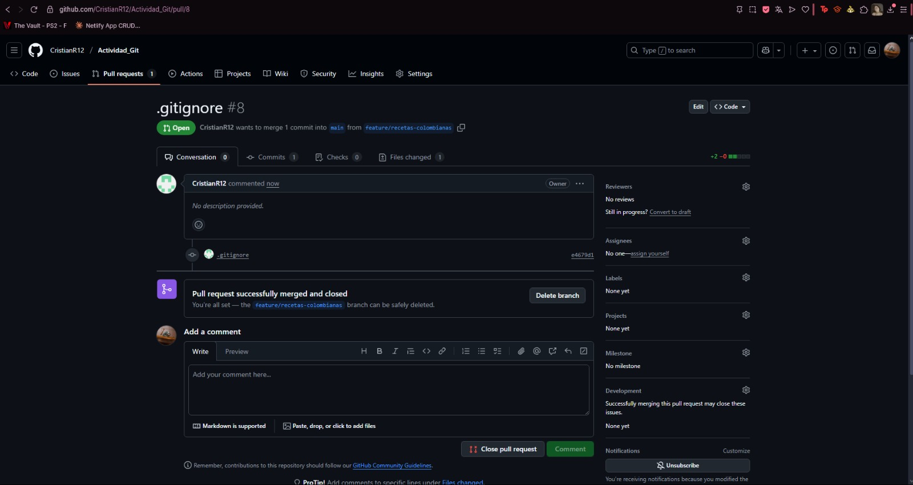

20. Los commits finales para el repositorio consisten en la adición de imágenes y modificaciones en rama-documentación para registrar todos los pasos realizados para la presente actividad.
Imagen 24: Cambios finales para la documentación en el repositorio.
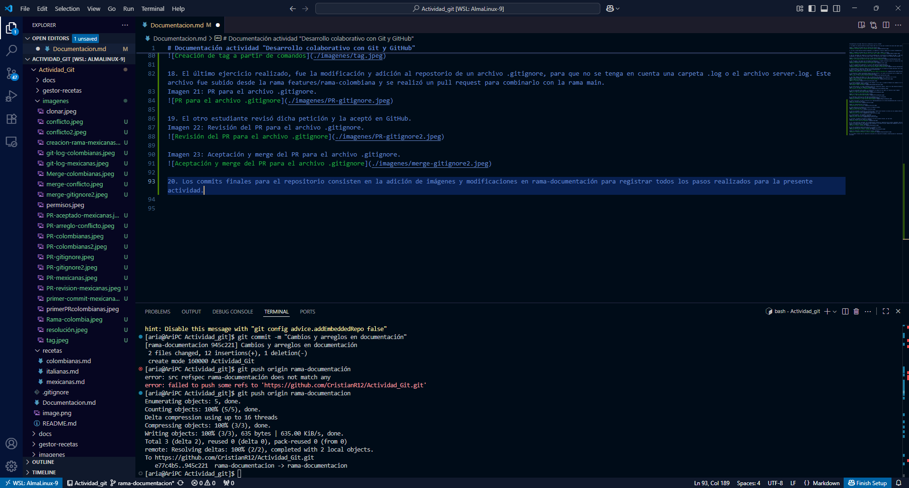

Relacionado a la documentación, se realizó un vídeo el cual también será adjuntado en el repositorio.

