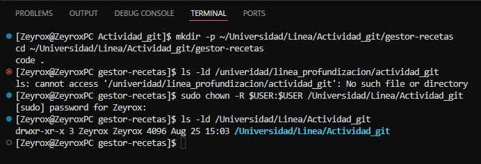

# Documentación actividad "Desarrollo colaborativo con Git y GitHub"

1. Se cambian los permisos dentro de Visual Studio Code con el fin de usar el editor del mismo como super usuario y asi crear el proyecto base

Imagen 1: Comandos utilizados para la creacion del proyecto base.

2. Se creo la rama features/recetas-colombianas y se empezaron a realizar cambios en el archivo colombianas.md

Imagen 2: Comandos utilizados para la creación de la nueva rama y cambio a la misma.

3. Una vez realizados los cambios en el archivo colombianas.md, se utilizaron los comandos "git add .", "git commit -m """ y "git push" para  subir los cambios a las recetas colombianas al repositorio. Con este primer commit, se realizó un pull request en la interfaz web de GitHub.

Imagen 3: Primer PR en GitHub por parte de la rama feature/recetas-colombianas.

4. Por otra parte, tras enviar una solicitud de colaboracion, el segundo estudiante realizó la clonación del repositorio.
Imagen 4: Comandos utilizados para la clonación del repositorio.

5. Tras la clonación del repositorio, se creó la rama features/recetas-mexicanas.
Imagen 5: Comandos utilizados para la creación de la rama para cambios en mexicanas.md.

6. Posteriormente se realizaron cambios en el archivo mexicanas.md y se eliminó una carpeta adicional vacía llamada "Actividad_Git" creada a partir de la clonación; con estos cambios se realizó el primer commit para la rama features/rama-mexicanas.
Imagen 6: Primer commit para recetas-mexicanas.

7. Se realizaron 2 commits adicionales después del paso anterior, los cuales se verificaron con el comando "git log".
Imagen 7: Git log para la rama features/recetas-mexicanas.

8. Con estos cambios realizados en la rama, se realizó un Pull Request para combinarlos con la main.
Imagen 8: PR en GitHub por parte de la rama feature/recetas-mexicanas.

Imagen 9: PR en en revisión.

9. El primer estudiante revisó y acepto el Pull Request, con lo cual, se aceptó el Merge de los cambios en la rama main.
Imagen 10: PR aceptado y Merge realizado.

10. De forma paralela, el primer estudiante realizó sus respectivos commits, tanto en la rama features/recetas-colombianas y features/recetas-italianas.
Imagen 11: Git log para los cambios en colombianas.md.

